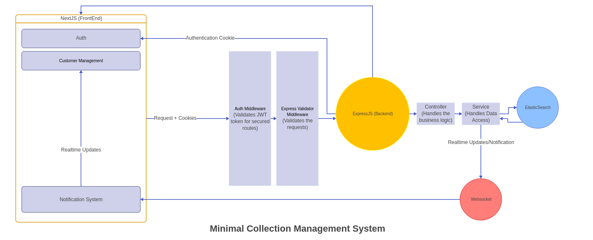

# Minimal collection management system

## Project Overview

This is a simple application for payment collection. 

The project is made with the following tech stack:
* Next.js
* Express.js
* Elasticsearch
* Swagger
* Docker

Features include

As specified in [Requirements](./mcms_assignment.pdf)

Some important notes are

1. Bulk customer upload via Excel
    * An example file also provided see [excel file](./sample_payments.xlsx)
2. Table view with filtering and sorting options
    * chose table view instead of list view for better UX.
   
3. Client payment
    * Two endpoints are needed for payment `/api/customer/initiate-payment` and `/api/customer/response-handler`  - see the swagger docs

4. Notification system
    * Notifications for realtime updates

## Setup Instructions

There are two ways to run the application

### Run via docker

You can run by running this command in root folder:

`docker-compose -f docker.compose.yml up --build`

### Run without docker

To run manually follow these instruction

1. Install and Run Elasticsearch, the instructions can be found at [ELASTICSEARCH](https://www.elastic.co/downloads/elasticsearch) for each platform

2. CD into both of these folders:
	* `express_msms` contains the express backend
	* `mcms` contains the nextjs frontend

3. run `npm run dev` into each

### Running the application

Open `localhost:3000` in browser

## Architecture

Due to very simple nature of the application, i'm providing a low level architecture of the important parts.

## Technical Decisions Explanation

I have divided reasoning for decisions into categories.

### Language choice

##### javascript on backend, typescript on frontend

1. I prefer strong type wherever possible, types are always preferable due to self documentation.
2. However this choice is to simplify backend, and avoid the extra configuration of build steps with `webpack` etc.
3. Swagger also helps a lot when working with backend, so i depend on that for docs.
2. Next.js gives great out of the box typescript support.

### Validation

##### Zod on frontend, express-validator on backend

1. This follows from language choices.
2. Zod works great with typescript to provide validation + free types.
3. express-validator is also works very well with express.js middleware model.

### Auth

##### Only decided to use email and password for an application user.
The reason to do this is that it achieves all the basic cases.

1. Avoids duplicate entries, unlike names.
2. Representable to users, unlike ID.

##### JWT token related

1. It's safer to pass token as http only cookie to avoid many common attacks, also makes handling of auth token on frontend.
2. JWT only contains an email field. 
3. It also has no expiry. 
4. The presence of email field is checked. This should be enough to provide very basic auth.
5. Refresh token also skipped for now.

##### bcryptjs instead of bcrypt

1. To avoid docker environment configuration for bcrypt.
2. bcryptjs is slower but works for testing.

### Customer table

##### Loading 1000 customers with each request.

1. Didn't implement pagination for simplicity.
2. 1000 customers should be enough for testing.

### Notification

##### Used notification system with addional info for realtime update of data

1. To avoid passing duplicate messages, that convey basically the same information.
2. Added notis for: Delete, Customer Update etc.
3. These weren't required by the requirements sheet, but are useful for realtime updates.

### Payment

##### Payment system has two apis

1. This is typically how payment gateways are done.
2. One api for creating an order for tracking, and this gives the user an entrypoint to initiating payment.
3. One api as callback for payment gateway, this handles the payment business logic using data given by payment gateway.

### UI/UX

##### Simple UI with Focus on UX

1. I decided to avoid using component libraries, styling things only with tailwind.
2. The UI is simple and everything is in plain sight.
3. Tried to make UX is as intuitive as possible.

### Testing

1. Wrote two tests for demo purposes.
2. Auth flow integeration test.
3. Bulk upload unit tests with two cases.

### Business Logic decisions/Misc
1. Over due isn't done realtime as, it only needs to update at end of day.
2. Assuming paid customer can't have an outstanding payment, paid customer automatically get 0 outstanding payment.
3. Assuming customers can only pay in full.
4. No api versioning for simplicity
5. No websocket connectionnn authentication for now, can be done in future via passing the token in url params
6. Used AI for swagger docs + some boilerplate/styling code.

## Future Improvements

1. More information should be asked for registering user.
2. For production app, typescript can be preferred for backend as well.
3. Elasticsearch is a decent NoSQL database, better choices can be SQL or MongoDB.
4. JWT auth can be improved for security purposes. Also a refresh token can be used.
5. The various actions of users can be logged into an entry for tracking any discrepencies.
6. More testing should be done.

## Conclusions/Final words

This was a fun project to work on, as i got to do a few things i hadn't done before.

The demo was quite a bit longer than i expected. This application+docs took me about 15 hours, divided over period of 3 days.

In the end it has been worth it to build this application, To get some more practice in Frontend in React which i haven't had the time for working on my personal projects.

I also had used elasticsearch only for full-text features, not as a complete database. So this was a learning experience as well.
